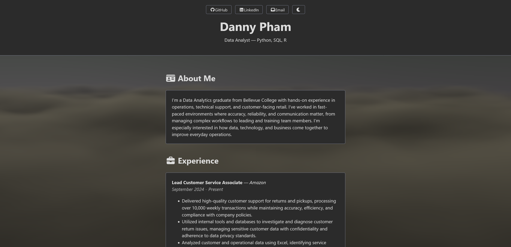

# Danny Pham's Personal Website

A professional personal portfolio built with a focus on high performance, clean aesthetics, and interactive user experience. Features a dynamic 3D background, smooth animations, and a fully responsive design.

**Live Site:** [dannyphamv.com](https://dannyphamv.com)



## Features

- **Dynamic 3D Background** - WebGL-powered cloud animation using Vanta.js
- **Dark/Light Theme** - Smooth theme switching with instant background updates
- **Scroll Animations** - Intersection Observer-based reveal effects
- **Typewriter Effect** - Automated typing animation for the headline
- **Scroll Progress Bar** - Visual indicator of reading progress
- **Fully Responsive** - Optimized for all screen sizes and devices
- **Performance Optimized** - Efficient DOM manipulation and optimized resize handlers

## Tech Stack

### Core Technologies
- **HTML5** - Semantic markup for accessibility
- **CSS3** - Custom styling with CSS variables for theming
- **JavaScript (ES6+)** - Interactive features and animations

### Libraries & Frameworks
- **Simple.css** - Lightweight CSS framework for clean, readable design
- **Vanta.js** - WebGL 3D background effects
- **Three.js** - 3D graphics rendering engine
- **Font Awesome 7** - Professional vector icons

### Deployment
- **GitHub Pages** - Automated deployment via GitHub Actions
- **Custom Domain** - Configured with CNAME for dannyphamv.com

## Project Structure

```
.
├── index.html          # Main HTML structure
├── custom.css          # Custom styles and theme variables
├── script.js           # Interactive features and animations
├── CNAME               # Custom domain configuration
├── sitemap.xml         # SEO sitemap
├── LICENSE             # MIT License
└── .github/
    └── workflows/
        └── jekyll-gh-pages.yml    # GitHub Pages deployment
```

## Installation & Usage

### Local Development

1. Clone the repository:
```bash
git clone https://github.com/dannyphamv/website.git
cd website
```

2. Open `index.html` in your browser or use a local server:
```bash
# Using Python 3
python -m http.server 8000

# Using Node.js
npx http-server
```

3. Navigate to `http://localhost:8000` in your browser

### Deployment

The site automatically deploys to GitHub Pages when changes are pushed to the `main` branch via GitHub Actions.

## Customization

### Theme Colors

Edit the CSS variables in `custom.css`:

```css
[data-theme="light"] {
    --bg: #fff;
    --accent: #0d47a1;
    /* ... */
}

[data-theme="dark"] {
    --bg: #212121;
    --accent: #ffb300;
    /* ... */
}
```

### Vanta.js Background

Modify the cloud settings in `script.js`:

```javascript
const vantaOptions = {
    backgroundColor: isDark ? 0x212121 : 0xffffff,
    skyColor: isDark ? 0x2b2b2b : 0x68b2ff,
    cloudColor: isDark ? 0x444444 : 0xadc1de,
    speed: 1.0
};
```

### Typewriter Text

Change the typewriter text in `script.js`:

```javascript
const text = "Your custom text here";
```

## Performance Features

- **Optimized Theme Switching** - Uses `.setOptions()` to update Vanta.js colors without recreation
- **Efficient Animations** - `will-change` property for smooth transitions
- **Lazy Loading** - Intersection Observer for scroll-reveal animations
- **Debounced Resize** - Optimized window resize handler

## Browser Support

- Chrome (recommended)
- Firefox
- Safari
- Edge
- Mobile browsers (iOS Safari, Chrome Mobile)

## License

This project is licensed under the MIT License - see the [LICENSE](LICENSE) file for details.

## Acknowledgments

- [Simple.css](https://simplecss.org/) - Minimal CSS framework
- [Vanta.js](https://www.vantajs.com/) - Animated backgrounds
- [Font Awesome](https://fontawesome.com/) - Icon library

---

Built with ❤️ using vanilla JavaScript
